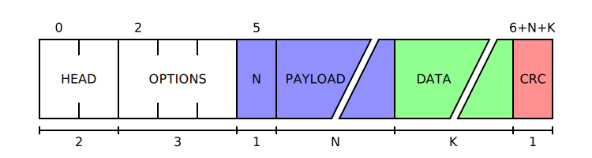

# ProtoViz

A fast and intuitive way of creating figures for protocol documentation.

Supports many features:
- Fixed and variable size fields
- Big and Little Endianness
- Many styling options (Background color, field color, text color)
- Line wrapping
- Field length and position subtitles
- Custom field width

It uses [Tera](https://keats.github.io/tera/docs) for generating the SVG file.

For a pratical use case, check the [examples readme](./examples/README.md) or the [ProtoViz Website](https://protoviz.stu.art.br).