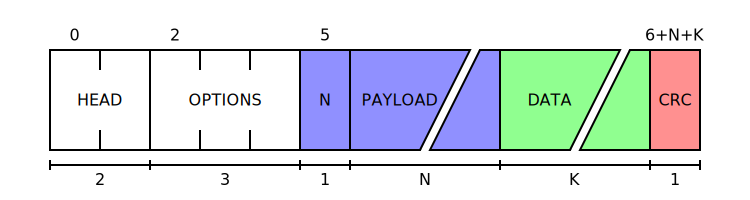

# ProtoViz

This library is an attempt to create a fast and intuitive way of creating figures for protocol specifications.

Currently it supports protocols with fixed and variable field sizes, with the option of showing field lengths and positions.

It uses [Tera](https://keats.github.io/tera/docs) for generating the SVG file.

For a pratical use case, check the [examples readme](./examples/README.md).