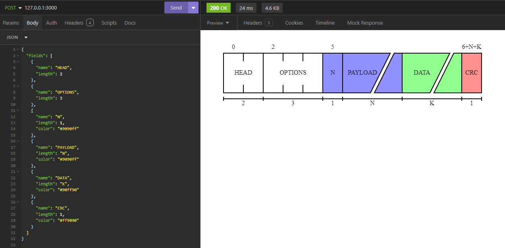

# ProtoViz Examples

## API
This example uses Axum to serve an API capable of converting JSON payloads into the ProtoViz SVG output.

You can run it with: ```cargo run --example api```



### JSON Format
- `style` (optional):
    - `background_color` (optional): Hex Color (RGB/RGBA) (Default: #ffffff)
        - Image background color
    - `field_color` (optional): Hex Color (RGB/RGBA) (Default: #ffffff)
        - Field background color
    - `text_color` (optional): Hex Color (RGB/RGBA) (Default: #000000)
        - Field text color (and stroke color)
    - `subtitle_color` (optional): Hex Color (RGB/RGBA) (Default: #000000)
        - Subtitle text color
- `elements` (optional):
    - `is_network` (optional): Bool (Default: true)
        - Whether the protocol uses network ordering (big-endian)
    - `position` (optional): Bool (Default: true)
        - Whether to show the position number at the start of each field
    - `length` (optional): Bool (Default: true)
        - Whether to show the length of each field
- `fields` (array of field objects):
    - `name`: String
        - The name of the field
    - `length`: String or Integer
        - The length of the field, with a string value meaning a variable length with the given name
    - `color` (optional): Hex Color (RGB/RGBA) (Default: fill_color)
        - Fill color for this specific field

    
